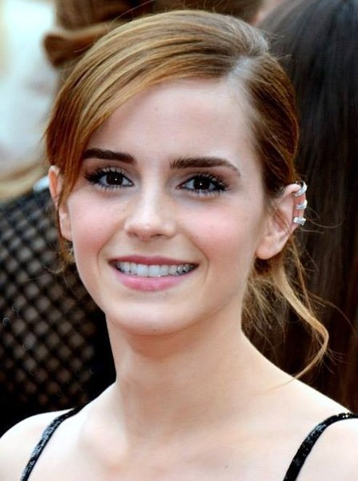

# Emma Watson

### About her

Emma Charlotte Duerre Watson (born 15 April 1990) is an English actress. She has been ranked among the world's highest-paid actresses by Forbes and Vanity Fair, and was named one of the 100 most influential people in the world by Time magazine in 2015. Watson was also listed by Forbes as an honouree on the Forbes 30 Under 30 list in 2015 and 2016.

Watson attended the Dragon School and trained in acting at the Oxford branch of Stagecoach Theatre Arts. As a child, she rose to stardom after landing her first professional acting role as Hermione Granger in the Harry Potter film series, having previously acted only in school plays. Watson made her first major foray beyond the Potter franchise starring in Ballet Shoes (2007), and she lent her voice to The Tale of Despereaux (2008). After the final Harry Potter film, she took on a supporting role in My Week with Marilyn (2011), before starring as Sam, a flirtatious, free-spirited student in The Perks of Being a Wallflower (2012), to critical success. Further acclaim came from portraying Alexis Neiers in Sofia Coppola's The Bling Ring (2013) and the titular character's adoptive daughter in Darren Aronofsky's biblical epic Noah (2014). That same year, Watson was honoured by the British Academy of Film and Television Arts, winning British Artist of the Year. She also starred as Belle in the live-action musical romantic fantasy Beauty and the Beast (2017), and as Meg March in Greta Gerwig's coming-of-age drama Little Women (2019).

From 2011 to 2014, Watson split her time between working on films and continuing her education, graduating from Brown University with a bachelor's degree in English literature in May 2014. That year, she was appointed a UN Women Goodwill Ambassador and helped launch the UN Women campaign HeForShe, which advocates for gender equality. In 2018, she helped launch Time's Up UK as a founding member. Watson was appointed to a G7 advisory body for women's rights in 2019, consulting with leaders on foreign policy. Her modelling work has included campaigns for Burberry and Lancôme. She also lent her name to a clothing line for the sustainable brand People Tree. From 2020 to 2023, she sat on the board of directors of Kering, a luxury brand group, in her capacity as an advocate for sustainable fashion.

### Timeline
1. 1990 – Born in Paris, France.
2. 1995 – Moves to England with her mother after her parents’ divorce.
3. 2001 – Breakthrough as Hermione Granger in Harry Potter and the Philosopher’s Stone.
4. 2009 – Begins studying English Literature at Brown University (USA).
5. 2014 – Graduates from Brown and becomes a UN Women Goodwill Ambassador; delivers the HeForShe speech at the UN.
6. 2017 – Stars in Beauty and the Beast, one of the highest-grossing films of the decade.
7. 2019 – Appears in Little Women and promotes sustainable fashion.
8. 2020–2022 – Steps back from acting; focuses on environmental activism and directing/writing.
9. 2023–2025 – Active in sustainability, women’s rights, and co-runs Renais Spirits, a sustainable gin brand with her brother.

### Links to a more detailed biography
[Wikipedia page](https://en.wikipedia.org/wiki/Emma_Watson)  
[IMDb page](https://www.imdb.com/name/nm0914612/bio/)

